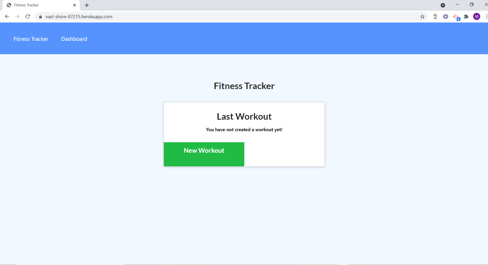
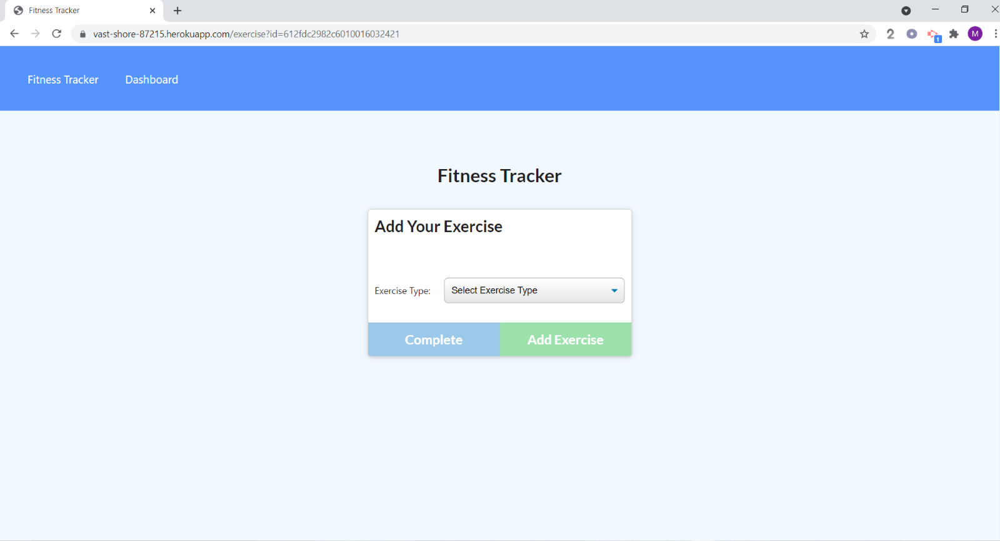

# Fit-Track
Fit-Track is a full stack application that enables the user to keep track of their workouts.  The user is able to add exercises to thier workouts, track duration time and see other statistics the pertain to their workouts.

### Built With:
* Node.js
* MongoDB
* Mongo Atlas
* JavaScript
* Express
* HTML
* CSS
* Heroku 

## Constructing the HTML Routes:
I required "express" router and "path."
Created three "get" routes that enabled the user to travel from the index.html file to the "stats" and "exercise" pages.

## Constructing the API Routes:
I required "exress router" and "path" inside the workoutRoutes.js file that is located inside the apiRoutes folder.  Inside the 
workoutRoutes.js file I created two "get" routes, one "put" route and one "post" route.  These routes enabled the user to add and and update workouts and exercises.

[Fit-Track](https://vast-shore-87215.herokuapp.com/)

